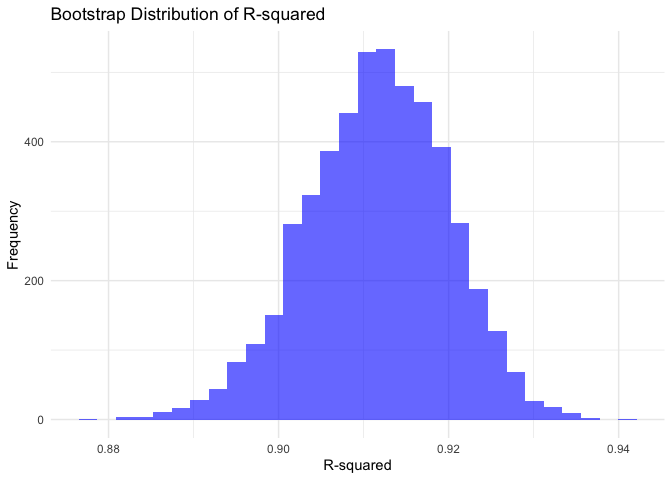
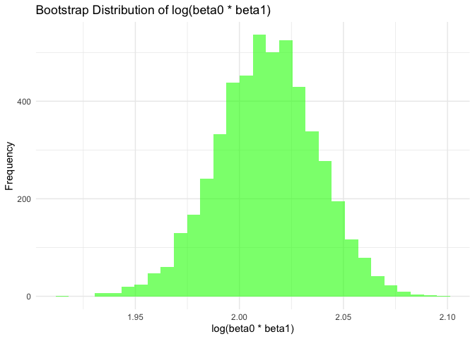
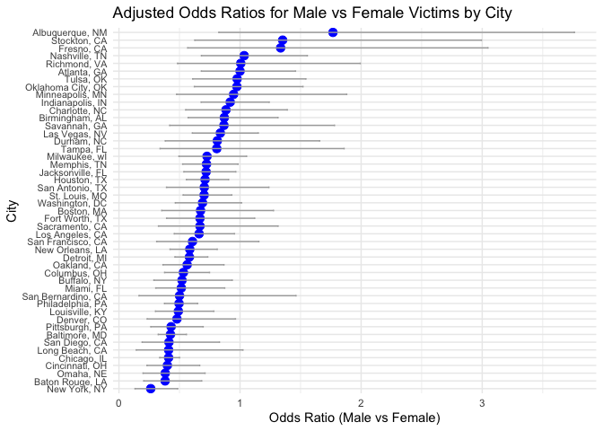
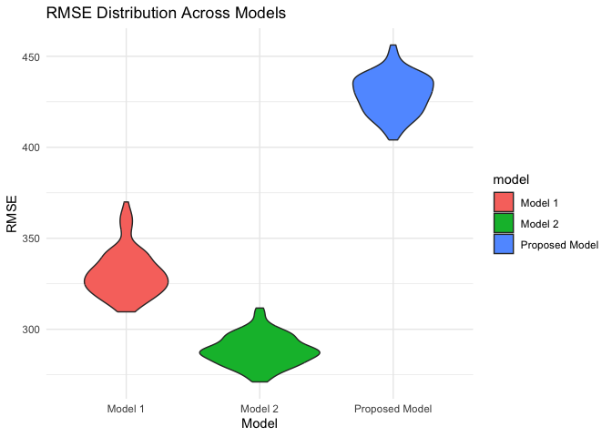
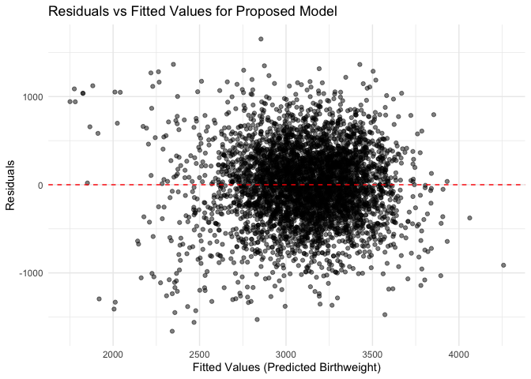

p8105_hw6_tq2171
================
Tingyu Qian
2024-11-27

``` r
# Load required libraries
library(dplyr)
```

    ## 
    ## Attaching package: 'dplyr'

    ## The following objects are masked from 'package:stats':
    ## 
    ##     filter, lag

    ## The following objects are masked from 'package:base':
    ## 
    ##     intersect, setdiff, setequal, union

``` r
library(broom)
library(ggplot2)
library(purrr)
library(tidyr)
library(modelr)
```

    ## 
    ## Attaching package: 'modelr'

    ## The following object is masked from 'package:broom':
    ## 
    ##     bootstrap

``` r
library(knitr)
```

## Problem 1

``` r
weather_df = 
  rnoaa::meteo_pull_monitors(
    c("USW00094728"),
    var = c("PRCP", "TMIN", "TMAX"), 
    date_min = "2017-01-01",
    date_max = "2017-12-31") %>%
  mutate(
    name = recode(id, USW00094728 = "CentralPark_NY"),
    tmin = tmin / 10,
    tmax = tmax / 10) %>%
  select(name, id, everything())
```

    ## using cached file: /Users/qty/Library/Caches/org.R-project.R/R/rnoaa/noaa_ghcnd/USW00094728.dly

    ## date created (size, mb): 2024-11-30 13:44:59.349634 (8.667)

    ## file min/max dates: 1869-01-01 / 2024-11-30

``` r
# Fit initial model
initial_model <- lm(tmax ~ tmin, data = weather_df)

# Bootstrap resampling
set.seed(456) 
bootstrap_results <- replicate(5000, {
  # Resample data with replacement
  bootstrap_sample <- weather_df %>% sample_frac(replace = TRUE)
  
  # Fit model to bootstrap sample
  model <- lm(tmax ~ tmin, data = bootstrap_sample)
  
  # Extract R-squared
  r_squared <- glance(model)$r.squared
  
  # Extract coefficients and compute log(beta0 * beta1)
  beta <- coef(model)
  log_beta_product <- log(beta[1] * beta[2])
  
  # Return the two quantities
  c(r_squared = r_squared, log_beta_product = log_beta_product)
}, simplify = "matrix")

# Convert results to a data frame
bootstrap_results <- as.data.frame(t(bootstrap_results))
colnames(bootstrap_results) <- c("r_squared", "log_beta_product")

# Calculate 95% confidence intervals
ci_r_squared <- quantile(bootstrap_results$r_squared, c(0.025, 0.975))
ci_log_beta_product <- quantile(bootstrap_results$log_beta_product, c(0.025, 0.975))

# Print confidence intervals
print("95% Confidence Interval for R-squared:")
```

    ## [1] "95% Confidence Interval for R-squared:"

``` r
print(ci_r_squared)
```

    ##      2.5%     97.5% 
    ## 0.8945195 0.9268154

``` r
print("95% Confidence Interval for log(beta0 * beta1):")
```

    ## [1] "95% Confidence Interval for log(beta0 * beta1):"

``` r
print(ci_log_beta_product)
```

    ##     2.5%    97.5% 
    ## 1.964852 2.058712

``` r
# Plot distributions of bootstrap estimates
ggplot(bootstrap_results, aes(x = r_squared)) +
  geom_histogram(bins = 30, fill = "blue", alpha = 0.6) +
  labs(title = "Bootstrap Distribution of R-squared",
       x = "R-squared",
       y = "Frequency") +
  theme_minimal()
```

<!-- -->

``` r
ggplot(bootstrap_results, aes(x = log_beta_product)) +
  geom_histogram(bins = 30, fill = "green", alpha = 0.6) +
  labs(title = "Bootstrap Distribution of log(beta0 * beta1)",
       x = "log(beta0 * beta1)",
       y = "Frequency") +
  theme_minimal()
```

<!-- -->

## Problem 2

``` r
# Load the data
homicide_data <- read.csv("./homicide-data.csv")
```

``` r
# Create `city_state` variable
homicide_data <- homicide_data %>%
  mutate(city_state = paste(city, state, sep = ", "))

# Omit specific cities and ensure victim_age is numeric
cleaned_data <- homicide_data %>%
  filter(!city_state %in% c("Dallas, TX", "Phoenix, AZ", "Kansas City, MO", "Tulsa, AL")) %>%
  filter(victim_age != "Unknown") %>%  # Remove rows with "Unknown" in `victim_age`
  mutate(victim_age = as.numeric(victim_age)) %>%
  mutate(
    resolved = ifelse(disposition == "Closed by arrest", 1, 0)  # Binary variable for solved/unsolved
  )

# Filter data to include only White or Black victims
filtered_data <- cleaned_data %>%
  filter(victim_race %in% c("White", "Black"))
```

``` r
# Filter data for Baltimore, MD
baltimore_data <- filtered_data %>%
  filter(city_state == "Baltimore, MD")
```

``` r
# Ensure variables are properly formatted
baltimore_data <- baltimore_data %>%
  mutate(
    victim_sex = factor(victim_sex, levels = c("Female", "Male")),  # Reference group: Female
    victim_race = factor(victim_race)  # Convert race to a factor
  )
```

``` r
# Fit logistic regression model
glm_model <- glm(resolved ~ victim_age + victim_sex + victim_race, 
                 data = baltimore_data, 
                 family = binomial)

# Summarize the model with broom::tidy
model_summary <- tidy(glm_model, exponentiate = TRUE, conf.int = TRUE)

# Extract odds ratio and confidence intervals for male vs female victims
male_vs_female_or <- model_summary %>% filter(term == "victim_sexMale")

# Print the results
kable(male_vs_female_or)
```

| term           |  estimate | std.error | statistic | p.value |  conf.low | conf.high |
|:---------------|----------:|----------:|----------:|--------:|----------:|----------:|
| victim_sexMale | 0.4255117 | 0.1381762 | -6.183864 |       0 | 0.3241908 | 0.5575508 |

``` r
# Group data by city_state and fit logistic regression for each city
city_results <- filtered_data %>%
  group_by(city_state) %>%
  nest() %>%
  mutate(
    glm_model = map(data, ~ glm(resolved ~ victim_age + victim_sex + victim_race, data = ., family = binomial)),
    tidy_model = map(glm_model, ~ tidy(.x, exponentiate = TRUE, conf.int = TRUE))
  ) %>%
  unnest(tidy_model) %>%
  filter(term == "victim_sexMale") %>%
  select(city_state, estimate, conf.low, conf.high)
```

    ## Warning: There were 44 warnings in `mutate()`.
    ## The first warning was:
    ## ℹ In argument: `tidy_model = map(glm_model, ~tidy(.x, exponentiate = TRUE,
    ##   conf.int = TRUE))`.
    ## ℹ In group 1: `city_state = "Albuquerque, NM"`.
    ## Caused by warning:
    ## ! glm.fit: fitted probabilities numerically 0 or 1 occurred
    ## ℹ Run `dplyr::last_dplyr_warnings()` to see the 43 remaining warnings.

``` r
# Print the results
kable(city_results)
```

| city_state         |  estimate |  conf.low | conf.high |
|:-------------------|----------:|----------:|----------:|
| Albuquerque, NM    | 1.7674995 | 0.8247081 | 3.7618600 |
| Atlanta, GA        | 1.0000771 | 0.6803477 | 1.4582575 |
| Baltimore, MD      | 0.4255117 | 0.3241908 | 0.5575508 |
| Baton Rouge, LA    | 0.3814393 | 0.2043481 | 0.6836343 |
| Birmingham, AL     | 0.8700153 | 0.5713814 | 1.3138409 |
| Boston, MA         | 0.6739912 | 0.3534469 | 1.2768225 |
| Buffalo, NY        | 0.5205704 | 0.2884416 | 0.9358300 |
| Charlotte, NC      | 0.8838976 | 0.5507440 | 1.3905954 |
| Chicago, IL        | 0.4100982 | 0.3361233 | 0.5008546 |
| Cincinnati, OH     | 0.3998277 | 0.2313767 | 0.6670456 |
| Columbus, OH       | 0.5324845 | 0.3770457 | 0.7479124 |
| Denver, CO         | 0.4790620 | 0.2327380 | 0.9624974 |
| Detroit, MI        | 0.5823472 | 0.4619454 | 0.7335458 |
| Durham, NC         | 0.8123514 | 0.3824420 | 1.6580169 |
| Fort Worth, TX     | 0.6689803 | 0.3935128 | 1.1211603 |
| Fresno, CA         | 1.3351647 | 0.5672553 | 3.0475080 |
| Houston, TX        | 0.7110264 | 0.5569844 | 0.9057376 |
| Indianapolis, IN   | 0.9187284 | 0.6784616 | 1.2413059 |
| Jacksonville, FL   | 0.7198144 | 0.5359236 | 0.9650986 |
| Las Vegas, NV      | 0.8373078 | 0.6058830 | 1.1510854 |
| Long Beach, CA     | 0.4102163 | 0.1427304 | 1.0241775 |
| Los Angeles, CA    | 0.6618816 | 0.4565014 | 0.9541036 |
| Louisville, KY     | 0.4905546 | 0.3014879 | 0.7836391 |
| Memphis, TN        | 0.7232194 | 0.5261210 | 0.9835973 |
| Miami, FL          | 0.5152379 | 0.3040214 | 0.8734480 |
| Milwaukee, wI      | 0.7271327 | 0.4951325 | 1.0542297 |
| Minneapolis, MN    | 0.9469587 | 0.4759016 | 1.8809745 |
| Nashville, TN      | 1.0342379 | 0.6807452 | 1.5559966 |
| New Orleans, LA    | 0.5849373 | 0.4218807 | 0.8121787 |
| New York, NY       | 0.2623978 | 0.1327512 | 0.4850117 |
| Oakland, CA        | 0.5630819 | 0.3637421 | 0.8671086 |
| Oklahoma City, OK  | 0.9740747 | 0.6228507 | 1.5199721 |
| Omaha, NE          | 0.3824861 | 0.1988357 | 0.7109316 |
| Philadelphia, PA   | 0.4962756 | 0.3760120 | 0.6498797 |
| Pittsburgh, PA     | 0.4307528 | 0.2626022 | 0.6955518 |
| Richmond, VA       | 1.0060520 | 0.4834671 | 1.9936248 |
| San Antonio, TX    | 0.7046200 | 0.3928179 | 1.2382509 |
| Sacramento, CA     | 0.6688418 | 0.3262733 | 1.3143888 |
| Savannah, GA       | 0.8669817 | 0.4185827 | 1.7802453 |
| San Bernardino, CA | 0.5003444 | 0.1655367 | 1.4623977 |
| San Diego, CA      | 0.4130248 | 0.1913527 | 0.8301847 |
| San Francisco, CA  | 0.6075362 | 0.3116925 | 1.1551470 |
| St. Louis, MO      | 0.7031665 | 0.5298505 | 0.9319005 |
| Stockton, CA       | 1.3517273 | 0.6256427 | 2.9941299 |
| Tampa, FL          | 0.8077029 | 0.3395253 | 1.8598834 |
| Tulsa, OK          | 0.9757694 | 0.6090664 | 1.5439356 |
| Washington, DC     | 0.6901713 | 0.4653608 | 1.0122516 |

``` r
# Create a plot of odds ratios with confidence intervals
ggplot(city_results, aes(x = reorder(city_state, estimate), y = estimate)) +
  geom_point(color = "blue", size = 3) +  # Points for OR estimates
  geom_errorbar(aes(ymin = conf.low, ymax = conf.high), width = 0.2, color = "darkgray") +  # CIs
  coord_flip() +  # Flip coordinates for better readability
  labs(
    title = "Adjusted Odds Ratios for Male vs Female Victims by City",
    x = "City",
    y = "Odds Ratio (Male vs Female)"
  ) +
  theme_minimal() +
  theme(axis.text.y = element_text(size = 8))  # Adjust text size for better readability
```

<!-- -->

The plot illustrates the adjusted odds ratios (ORs) for solving
homicides comparing male victims to female victims across different
cities. Most cities cluster around an OR of 1, indicating little
difference in the likelihood of solving homicides based on the victim’s
sex. However, some cities show ORs significantly greater than 1,
suggesting that male victims’ cases are more likely to be solved than
those of female victims, while others have ORs less than 1, implying the
opposite. Cities with wide confidence intervals reflect high
uncertainty. In contrast, cities with narrow intervals likely have more
reliable estimates. A few cities stand out as outliers with notably high
or low ORs, which could indicate unique factors affecting case
resolution. Additionally, confidence intervals crossing 1 suggest no
statistically significant difference in some cities, even if their ORs
deviate from 1. Overall, the plot highlights disparities in how victim
sex may influence case outcomes, underscoring the need for further
investigation into the underlying causes in cities with extreme or
unusual trends.

## Problem 3

``` r
# Load the data
birthweight_data <- read.csv("./birthweight.csv")

# Convert categorical variables to factors
birthweight_data <- birthweight_data %>%
  mutate(
    babysex = factor(babysex, levels = c(1, 2), labels = c("Male", "Female")),
    frace = factor(frace, levels = c(1, 2, 3, 4, 8, 9),
                   labels = c("White", "Black", "Asian", "Puerto Rican", "Other", "Unknown")),
    malform = factor(malform, levels = c(0, 1), labels = c("Absent", "Present")),
    mrace = factor(mrace, levels = c(1, 2, 3, 4, 8),
                   labels = c("White", "Black", "Asian", "Puerto Rican", "Other"))
  )

# Check for potential outliers in numeric variables
summary(birthweight_data)
```

    ##    babysex         bhead          blength           bwt           delwt      
    ##  Male  :2230   Min.   :21.00   Min.   :20.00   Min.   : 595   Min.   : 86.0  
    ##  Female:2112   1st Qu.:33.00   1st Qu.:48.00   1st Qu.:2807   1st Qu.:131.0  
    ##                Median :34.00   Median :50.00   Median :3132   Median :143.0  
    ##                Mean   :33.65   Mean   :49.75   Mean   :3114   Mean   :145.6  
    ##                3rd Qu.:35.00   3rd Qu.:51.00   3rd Qu.:3459   3rd Qu.:157.0  
    ##                Max.   :41.00   Max.   :63.00   Max.   :4791   Max.   :334.0  
    ##     fincome               frace         gaweeks         malform    
    ##  Min.   : 0.00   White       :2123   Min.   :17.70   Absent :4327  
    ##  1st Qu.:25.00   Black       :1911   1st Qu.:38.30   Present:  15  
    ##  Median :35.00   Asian       :  46   Median :39.90                 
    ##  Mean   :44.11   Puerto Rican: 248   Mean   :39.43                 
    ##  3rd Qu.:65.00   Other       :  14   3rd Qu.:41.10                 
    ##  Max.   :96.00   Unknown     :   0   Max.   :51.30                 
    ##     menarche        mheight          momage              mrace     
    ##  Min.   : 0.00   Min.   :48.00   Min.   :12.0   White       :2147  
    ##  1st Qu.:12.00   1st Qu.:62.00   1st Qu.:18.0   Black       :1909  
    ##  Median :12.00   Median :63.00   Median :20.0   Asian       :  43  
    ##  Mean   :12.51   Mean   :63.49   Mean   :20.3   Puerto Rican: 243  
    ##  3rd Qu.:13.00   3rd Qu.:65.00   3rd Qu.:22.0   Other       :   0  
    ##  Max.   :19.00   Max.   :77.00   Max.   :44.0                      
    ##      parity            pnumlbw     pnumsga      ppbmi            ppwt      
    ##  Min.   :0.000000   Min.   :0   Min.   :0   Min.   :13.07   Min.   : 70.0  
    ##  1st Qu.:0.000000   1st Qu.:0   1st Qu.:0   1st Qu.:19.53   1st Qu.:110.0  
    ##  Median :0.000000   Median :0   Median :0   Median :21.03   Median :120.0  
    ##  Mean   :0.002303   Mean   :0   Mean   :0   Mean   :21.57   Mean   :123.5  
    ##  3rd Qu.:0.000000   3rd Qu.:0   3rd Qu.:0   3rd Qu.:22.91   3rd Qu.:134.0  
    ##  Max.   :6.000000   Max.   :0   Max.   :0   Max.   :46.10   Max.   :287.0  
    ##      smoken           wtgain      
    ##  Min.   : 0.000   Min.   :-46.00  
    ##  1st Qu.: 0.000   1st Qu.: 15.00  
    ##  Median : 0.000   Median : 22.00  
    ##  Mean   : 4.145   Mean   : 22.08  
    ##  3rd Qu.: 5.000   3rd Qu.: 28.00  
    ##  Max.   :60.000   Max.   : 89.00

``` r
# model
model_formula <- bwt ~ gaweeks + ppbmi + wtgain + smoken + mrace + babysex + malform

# Model 1: Length at birth and gestational age
model_1_formula <- bwt ~ blength + gaweeks

# Model 2: Head circumference, length, sex, and interactions
model_2_formula <- bwt ~ bhead * blength * babysex
```

``` r
# Monte Carlo Cross-Validation
set.seed(123) 
cv_splits <- crossv_mc(birthweight_data, 100) %>%
  mutate(
    train = map(train, as_tibble),
    test = map(test, as_tibble)
  )

# Fit models and calculate RMSE
cv_splits <- cv_splits %>%
  mutate(
    # Fit models on training data
    proposed_mod = map(train, ~ lm(model_formula, data = .x)),
    model_1_mod = map(train, ~ lm(model_1_formula, data = .x)),
    model_2_mod = map(train, ~ lm(model_2_formula, data = .x)),
    
    # Calculate RMSE on test data
    rmse_proposed = map2_dbl(proposed_mod, test, ~ rmse(model = .x, data = .y)),
    rmse_model_1 = map2_dbl(model_1_mod, test, ~ rmse(model = .x, data = .y)),
    rmse_model_2 = map2_dbl(model_2_mod, test, ~ rmse(model = .x, data = .y))
  )

# Summarize RMSE results
rmse_summary <- cv_splits %>%
  select(rmse_proposed, rmse_model_1, rmse_model_2) %>%
  pivot_longer(everything(), names_to = "model", values_to = "rmse") %>%
  mutate(model = recode(model,
                        rmse_proposed = "Proposed Model",
                        rmse_model_1 = "Model 1",
                        rmse_model_2 = "Model 2"))

# Plot RMSE distribution
ggplot(rmse_summary, aes(x = model, y = rmse, fill = model)) +
  geom_violin() +
  labs(
    title = "RMSE Distribution Across Models",
    x = "Model",
    y = "RMSE"
  ) +
  theme_minimal()
```

<!-- -->

``` r
# Residual Plot for Proposed Model
birthweight_data <- birthweight_data %>%
  add_predictions(lm(model_formula, data = birthweight_data), var = "fitted") %>%
  add_residuals(lm(model_formula, data = birthweight_data), var = "residuals")

ggplot(birthweight_data, aes(x = fitted, y = residuals)) +
  geom_point(alpha = 0.5) +
  geom_hline(yintercept = 0, linetype = "dashed", color = "red") +
  labs(
    title = "Residuals vs Fitted Values for Proposed Model",
    x = "Fitted Values (Predicted Birthweight)",
    y = "Residuals"
  ) +
  theme_minimal()
```

<!-- -->

The modeling process began with proposing a regression model for
predicting birthweight based on biologically relevant factors, including
gestational age, maternal characteristics (e.g., pre-pregnancy BMI,
weight gain, smoking habits, and race), and baby-specific factors (e.g.,
sex and presence of malformations). This proposed model was developed
based on both domain knowledge and hypothesized relationships affecting
birthweight. To compare its performance, two alternative models were
introduced: one using length at birth and gestational age as predictors
(main effects only) and another incorporating head circumference,
length, sex, and all two-way and three-way interactions between these
variables. Monte Carlo cross-validation was used to evaluate model
performance, with 100 random train-test splits generated to ensure
robust results. Each model was fitted on the training data, and RMSE
(root mean square error) was computed on the test data to assess
prediction accuracy. Finally, the residuals of the proposed model were
plotted against fitted values to check for assumptions of linearity,
homoscedasticity, and absence of patterns, ensuring the validity of the
model. This comprehensive process allowed for a thorough evaluation and
comparison of predictive performance across all models.

The results of the model comparison indicate distinct differences in
predictive performance. The RMSE distribution across models reveals that
Model 2, which incorporates head circumference, length at birth, sex,
and all interactions, achieves the lowest RMSE, suggesting it provides
the most accurate and consistent predictions. Model 1, which includes
only length at birth and gestational age as predictors, performs
moderately well with a narrower RMSE distribution but does not achieve
the same level of accuracy as Model 2. The proposed model, which
incorporates gestational age, maternal characteristics (e.g.,
pre-pregnancy BMI, weight gain, smoking status), and baby-specific
factors (e.g., sex and malformations), has the highest RMSE and
underperforms compared to the other models, likely due to its inability
to capture more complex interactions and relationships.

The residual plot for the proposed model shows generally random scatter
around zero, indicating that the model assumptions of linearity and
homoscedasticity are reasonably met. However, the presence of some
larger residuals points to potential outliers that may influence the
model’s performance. While the proposed model aligns well with
biological reasoning and offers interpretability, its relatively higher
RMSE indicates it is less effective at predicting birthweight compared
to Model 2. Overall, Model 2 is the preferred choice for predictive
accuracy, whereas the proposed model may still be useful for
interpretative analysis due to its simplicity and grounding in
hypothesized factors.
